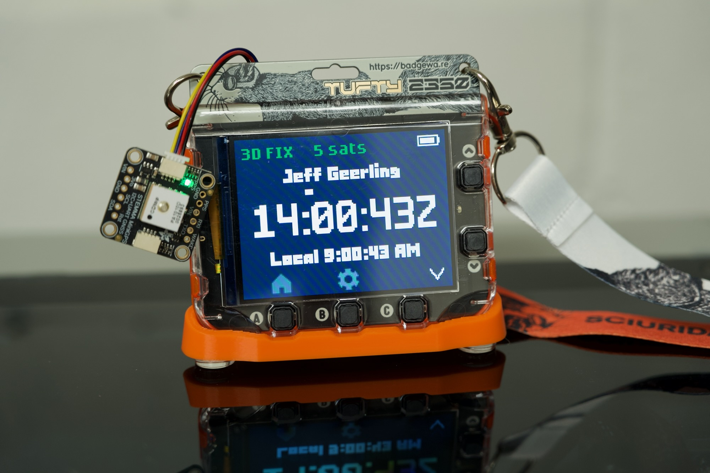

# GPS Time for Tufty 2350

A GPS time app for Pimoroni's [Tufty 2350](https://shop.pimoroni.com/products/tufty-2350?variant=55811986194811), using the [Adafruit Mini GPS PA1010D](https://www.adafruit.com/product/4415) GPS module.

The PA1010D is built around MediaTek's [MT3333 GPS SoC](https://ia902802.us.archive.org/21/items/mt3333-datasheet/MT3333_Datasheet.pdf). It uses around 30 mW of power when tracking, and 40 mW during acquisition. PPS output is accurate to within ±20 ns.

The module plugs in with a [50mm QWIIC cable](https://shop.pimoroni.com/products/jst-sh-cable-qwiic-stemma-qt-compatible?variant=40407104290899)—I'm using one that came with the STEM kit.

## AI Disclosure

Much of the code was generated by Claude Sonnet 5 (Medium). The initial prompt is shown in `Requirements.md`, but I'm lazy and don't have my full chat history incorporated into this repo, sorry.

## Hardware

Plug the [Adafruit PA1010D GPS](https://www.adafruit.com/product/4415) module directly into the QWIIC plug labeled 'I2C' on the back of the Tufty 2350.

You can plug into either side of the GPS module.

### PPS Watch Compatibility

The GPS Time app includes support for the u-blox MAX-M10S, but is is not enabled by default. To use it (e.g. with a [PPS Watch](https://github.com/idlehandsdev/pps-watch)'s QWIIC connector output):

  1. Plug a QWIIC cable between the Tufty and the MAX-M10S device
  1. Turn on the Tufty, then turn on the MAX-M10S device (if it requires separate power, as is the case with the PPS Watch)
  1. Open the GPS Time app
  1. Go into settings (the Cog icon)
  1. Move down to the 'GPS Module Address' setting, and change it from `0x10` to `0x42`
  1. Press B to go back to the GPS Time main screen

At this point, the GPS Time app should configure the MAX-M10S to send over NMEA sentences so it can get timing data.

> **NOTE**: The first version of the PPS Watch PCB had the QWIIC connector reversed. [I made a QWIIC crossover cable](https://github.com/geerlingguy/tufty-gps-time/issues/1) for compatibility. If you have one of these early PPS Watches, make sure you reverse the connections between the boards!

### 3D Printed GPS bracket

For best GPS reception, the patch antenna (the big ceramic thing on top of the GPS chip) should face the sky. So I've modified the official [Badgeware Multi-sensor Stick Clip](https://www.printables.com/model/1726590-badgeware-multi-sensor-stick-clip) design to hold the GPS module vertically, so it will be pointed 'up' while you're wearing the badge.

TODO: Design and print a bracket based on [Badgeware Multi-sensor Stick Clip](https://www.printables.com/model/1726590-badgeware-multi-sensor-stick-clip) that holds GPS module vertically at top of badge.

Sources used for 3D modeling the bracket:

  - [Pimoroni Badgeware Blank](https://www.printables.com/model/1779998-pimoroni-badgeware-blank/files)
  - [Pimoroni Badgeware Multi-Sensor Stick Clip](https://www.printables.com/model/1726590-badgeware-multi-sensor-stick-clip)
  - [AdaFruit 4415 Mini GPS PA1010D](https://learn.adafruit.com/adafruit-mini-gps-pa1010d-module/downloads)

This bracket is also useful if you're debugging the badge or displaying it on your desk using the [Badgeware stand](https://www.printables.com/model/1726520-badgeware-stand).

### PPS Output

I would also like to have an SMA or BNC plug available for PPS output directly from the GPS module.

TODO: Add method for PPS testing, maybe two-pin header with a female BNC or SMA connector soldered to a two-pin plug that goes into that header.

### PPS Input

See discussion [PPS input on Tufty GPIO pin?](https://forums.pimoroni.com/t/pps-input-on-tufty-gpio-pin/28958) for more on PPS input.

## Software

This process was validated on a Mac running macOS 26. Use on other OSes may vary.

To install the GPS Time app on your Tufty 2350 badge:

  1. Plug Tufty 2350 into your computer with a USB cable
  2. Double-click the 'RESET' button on the back of the badge to enter USB Disk Mode
  3. Copy over the entire `gps_time` directory into Tufty's `apps` directory
  4. Eject the TUFTY volume.
  5. The GPS Time app should be showing in the apps list now

Alternatively, you can just run `update_tufty.sh` to copy over the app once you have the TUFTY volume mounted.

Updating the software:

  1. Do all the above to get the TUFTY volume mounted.
  1. Run the `update_tufty.sh` script to copy over the updated Python code and unmount the TUFTY volume.

## Author

Authored by [Jeff Geerling](https://www.jeffgeerling.com) in 2026, with help from Claude Sonnet 5 and Pimoroni's excellent forum users.
